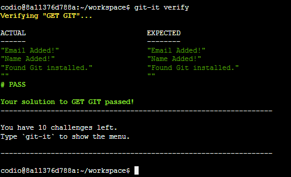
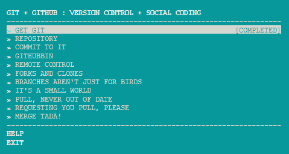

#Tutorial 05 - Git-it
**Learn Git and GitHub basics.**

*All content is written and produced by [http://nodeschool.io](http://nodeschool.io). Please see the credits at the bottom of this page and if you have learnt a lot from these tutorials, please make a donation (also at the bottom).*

#Video
If you prefer a video rather than reading the instructions below, there is a video that runs through the Codio + Nodeschool.io system (yes, it's a tutorial on how to use the tutorial) : [https://vimeo.com/86100550](https://vimeo.com/86100550)

#Installation
1. Create an account with http://codio.com (don't be frightened, it's free for all public projects).
1. You're probably looking at this in GitHub already but if not, go to [https://github.com/codio](https://github.com/codio) and search for "Nodeschool", then select the tutorial you want.
2. Copy the SSH or HTTPS url from beneath al the GitHub settings on the right hand side (NOT the main browser page url).
3. Go to [Create Project](https://codio.com/s/docs/console/creating/) in your Codio Dashboard, select the Git tab and paste in the url you just copied.
4. Press Create Project and you'll be in the IDE with your tutorial project ready and waiting.

You'll now need to install the Nodeschool tutorial (each one is an npm package) onto your project's Box. There are two ways to do this ...

- Hands Dirty: open up a Terminal with from the 'Tools->Terminal' menu, then enter `npm install -g git-it@latest`.
- Lazy Way: click on the "Install Git-it" menu item. Once installed, you can close that tab.

#2 Writing your code
There are two different ways you can use Codio to run the Nodeschool.io tutorials. You can switch between them at any time. The great thing is that your code is neatly organized into lessons that you can refer back to later.

- **Tutorial Mode** : select the 'Tools->Tutorial' menu item. Each lesson is presented with a Code window on the left and the instructions on the right, which can be scrolled through and left in place while you code. You can navigate between lessons using the buttons above the instructions.
- **Manual Mode** : open up the lessons folders and you will see a filename similar to the folder name. As this tutorial is all done in the terminal simply click on the blue icon in the gutter to open up the instructions popup.

#Testing your code
Git-It has a different format to other Nodeschool.io tutorials. You don't write code, you use the terminal

###1. Shell out to the Terminal
You can open a Terminal window at any time by selecting the 'Tools->Terminal' menu item. Your terminal defaults to the `~/workspace` folder, which equates to the root of your Codio code project. It is here that you enter your commands

#Verifying your code
Once you think you have completed the challenge, enter `git-it` to view the Lesson menu. Use your arrow keys to select the appropriate lesson and <enter>. 

Then enter `git-it verify`. The output will be shown in the console window. If is passes, you will see something like this

#Which lessons have I successfully completed?
As you verify and pass each lesson (or by entering `git-it` in the command line at any time, you will be shown in the console the list of all challenges that are already completed. You will see the following screen in the Terminal window hat appears. Completed lessons are clearly marked on the right.

#Doing everything from the command line
For this tutorial, you do everything from the command line rather than using Codio. Just open up the Terminal window from 'Tools->Terminal'.

#Other Tutorials
[http://nodeschool.io](http://nodeschool.io) has a several excellent tutorials. We have packaged these up so they run within Codio and the full set can be found on our [Nodeschool Tutorial page.](http://codio.com/tutorials)

#Credits

The Nodeschool tutorials are the much excellent work of the following hackers

Rod Vagg ([github/rvagg](https://github.com/rvagg), [twitter@rvagg](http://twitter.com/rvagg)), 
Andrey Sidorov ([github/sidorares](https://github.com/sidorares), [twitter@sidorares](http://twitter.com/sidorares)), 
Julián Duque ([github/julianduque](https://github.com/julianduque), [twitter@julian_duque](http://twitter.com/julian_duque)), 
Lars-Magnus Skog ([github/ralphtheninja](https://github.com/ralphtheninja), [twitter@ralphtheninja](http://twitter.com/ralphtheninja)), 
Tim Inman ([github/thehack](https://github.com/thehack), [twitter@timinman](http://twitter.com/timinman)), 
Dan Flettre ([github/Flet](https://github.com/Flet), [twitter@flettre](http://twitter.com/flettre)) 

##Donations
If you feel you have benefitted from this or the other tutorials, how about [donating to Rodd Vagg using gittip](https://www.gittip.com/rvagg/)